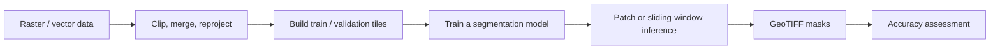
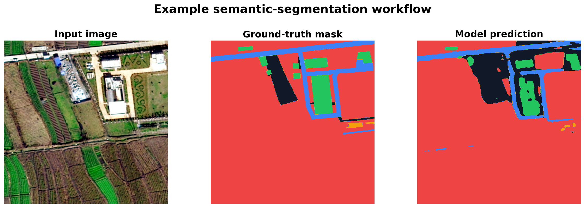

# Remote-Sensing Semantic Segmentation Toolkit

An end-to-end PyTorch toolkit for preparing geospatial data, training semantic-segmentation models, predicting land-cover classes, running tiled inference on large rasters, and evaluating the resulting masks.


> **Repository scope.** Source code and documentation are versioned here. Large imagery, labels, checkpoints, and generated outputs are intentionally excluded from Git.

## What this project does

The repository connects the main stages of a remote-sensing segmentation workflow:



Key capabilities:

- Train and evaluate multi-class semantic-segmentation models with PyTorch.
- Run folder-based prediction or sliding-window inference on large rasters.
- Create, clip, merge, reproject, recolor, and convert raster/vector data.
- Calculate confusion-matrix metrics and Dice scores.
- Construct models through `segmentation-models-pytorch`, including U-Net, U-Net++, DeepLabV3(+), FPN, PSPNet, UPerNet, SegFormer, LinkNet, MAnet, PAN, and DPT.

## Input and output

The figure below uses a real sample bundled with the local development dataset. The large source dataset is not distributed in this repository.



| Stage | Expected format | Shape / values |
|---|---|---|
| Input | `.tif` image tile | RGB, typically `512 × 512 × 3` |
| Label | `.tif` categorical mask | `512 × 512`; integer class IDs |
| Prediction | `.tif` categorical mask | Same spatial size; integer class IDs |

## Repository layout

```text
.
├── geoseg/
│   ├── datasets/             # Dataset loading and paired augmentations
│   ├── models/               # Model factory
│   ├── raster_inference/     # Tiled inference helpers
│   ├── tools/                # Dataset statistics and image utilities
│   ├── utils/                # Losses, metrics, and distributed helpers
│   ├── train.py              # Training entry point
│   ├── predict.py            # Tile-level prediction and evaluation
│   └── slide_inference.py    # Large-raster sliding-window inference
├── geotools/                 # Raster/vector preprocessing utilities
└── docs/assets/              # Lightweight README figures
```

## Quick start

### 1. Create an environment

```bash
conda create -n geoseg python=3.10 -y
conda activate geoseg
```

### 2. Install dependencies

Install PyTorch using the command appropriate for your operating system and CUDA version, then install the project dependencies. If you want to use the pinned legacy PyTorch stack, install the requirements file directly:

```bash
pip install -r geoseg/requirements.txt
```

For GPU-specific PyTorch installation commands, consult the official PyTorch installation selector.

### 3. Prepare the dataset

Image and label filenames must match after sorting. Use this structure:

```text
dataset/
├── train/
│   ├── images/
│   │   ├── tile_001.tif
│   │   └── tile_002.tif
│   └── labels/
│       ├── tile_001.tif
│       └── tile_002.tif
└── val/
    ├── images/
    │   └── tile_101.tif
    └── labels/
        └── tile_101.tif
```

For large scenes, create training tiles with `geotools/slide_clip.py`. A tile size near `512 × 512` is a practical starting point, but it should be selected according to spatial resolution, object scale, and GPU memory.

### 4. Train

The current training entry point uses U-Net by default. Paths and training settings can be supplied from the command line:

```bash
cd geoseg
python train.py \
  --data-path /path/to/dataset \
  --weight-path ./work_dirs/unet_experiment \
  --num-classes 6 \
  --epochs 50 \
  --batch-size 4 \
  --device cuda:0
```

`--num-classes` excludes the background class; the script adds the background internally.

### 5. Predict image tiles

```bash
python predict.py \
  --weight-path ./work_dirs/unet_experiment/best_model.pth \
  --img-path /path/to/test/images \
  --out-path ./predictions \
  --lab-path /path/to/test/labels \
  --num-classes 6 \
  --device cuda
```

When `--lab-path` is provided, the script also reports segmentation metrics against the reference labels.

### 6. Run inference on a large raster

```bash
python slide_inference.py \
  --weight-path ./work_dirs/experiment/best_model.pth \
  --img-path /path/to/large_rasters \
  --out-path ./large_raster_predictions \
  --num-classes 4 \
  --win-size 500 \
  --step-size 512 \
  --pad-size 6
```

The window, step, and padding parameters must be mutually consistent. Validate edge handling and seam artifacts on a small scene before batch inference.

## Model selection

Model constructors are registered in `geoseg/models/create_models.py`:

```python
from models.create_models import create_model

model = create_model(model_name="unet", num_classes=7)
```

Available names are `unet`, `unetplusplus`, `deeplabv3`, `deeplabv3p`, `fpn`, `pspnet`, `upernet`, `segformer`, `linknet`, `manet`, `pan`, and `dpt`.

The training and prediction entry points currently instantiate U-Net directly. To run another architecture, change the `model_name` consistently in both scripts and ensure that training and inference use the same class count and checkpoint architecture.

## Geospatial utilities

The `geotools/` directory contains standalone scripts for common preprocessing operations:

| Task | Script |
|---|---|
| Sliding-window clipping and merging | `slide_clip.py`, `slide_merge.py` |
| Raster clipping and merging | `ras_clip_ras.py`, `ras_clip_vec.py`, `ras_merge.py` |
| Vector clipping and merging | `vec_clip_ras.py`, `vec_clip_vec.py`, `vec_merge.py` |
| Raster/vector conversion | `ras_to_vec.py`, `vec_to_ras.py` |
| Projection assignment | `ras_add_proj.py`, `vec_add_proj.py` |
| Band operations | `channel_split.py`, `channel_merge.py` |
| Label remapping and palette creation | `change_value.py`, `add_palette.py` |
| Accuracy assessment | `precision.py` |

Several utility scripts contain example paths in their `__main__` blocks. Replace them with your own paths before execution.

## Reproducibility notes

- Large training data and model checkpoints are not included. You must provide your own imagery, labels, and trained weights.
- Some scripts currently contain machine-specific default paths; explicit command-line paths are recommended.
- The model definitions use ImageNet-pretrained encoders and three-channel inputs by default.
- Label IDs must be contiguous and compatible with the configured class count.
- Verify the coordinate reference system, affine transform, nodata value, and output dtype before using predictions in GIS analysis.
- The example figure is illustrative; it is not evidence of benchmark performance. Report quantitative results on an independent test set before making accuracy claims.

## Data and checkpoint policy

The `.gitignore` excludes rasters, arrays, checkpoints, generated outputs, and local datasets. For reproducible releases, publish datasets and weights through an appropriate archival repository and document versioned download links and checksums here. Do not commit large binary assets directly to Git history.

## License

No open-source license has been selected yet. Until a license is added, the source is publicly viewable but reuse rights are not granted automatically.
